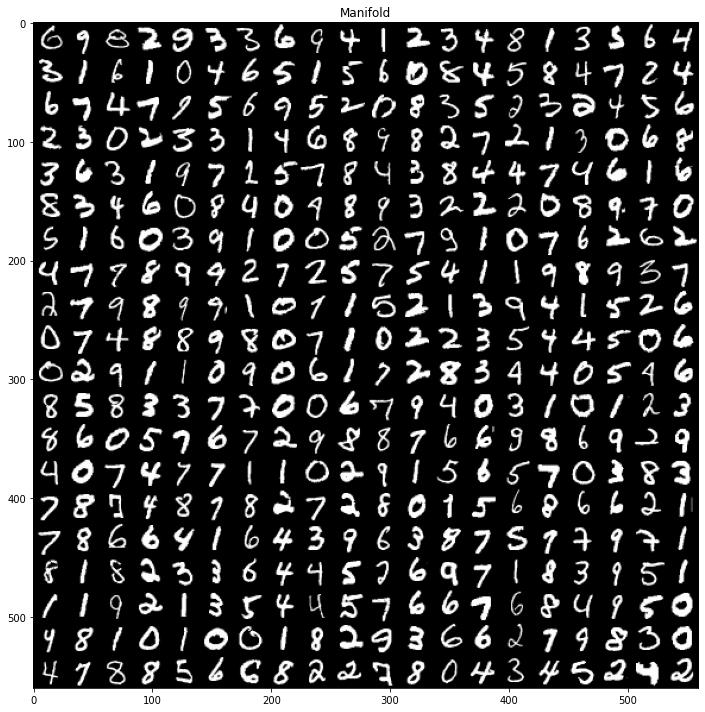
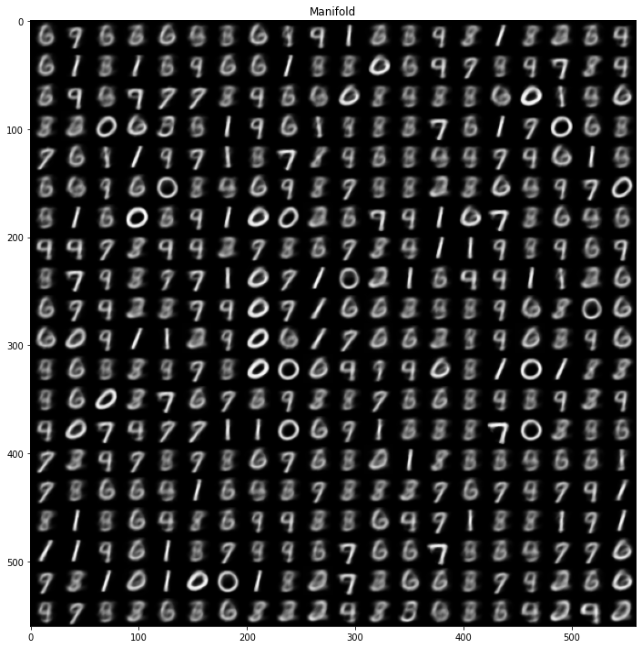
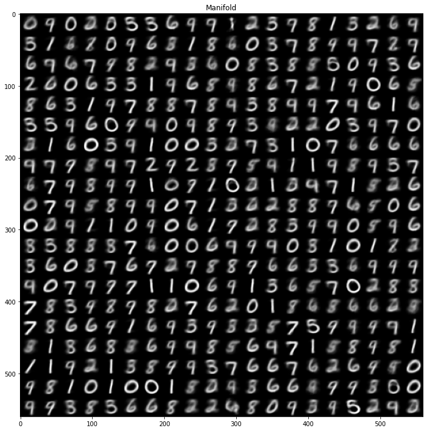
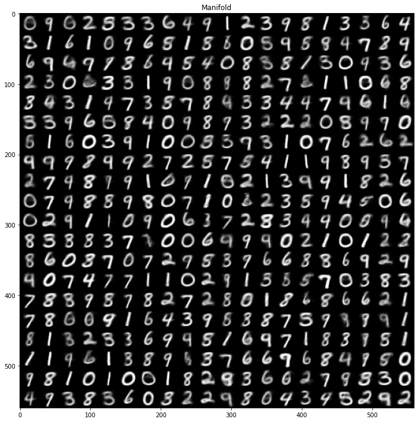

# VAE-Tensorflow2.0

  이활석님의 [오토인코더의 모든것](https://www.youtube.com/watch?v=o_peo6U7IRM&t=2888s) 강의를 듣고 내용이 좋아서 VAE를 Tensorflow 2.0으로 구현하였다. 이론에 대한 자세한 설명은 [블로그](https://ehfkswl.tistory.com/3)에서 볼 수 있다.

## files
    load_data         # load data set and show img
    main              # training for model
    model             # VAE model class

## Result
- reconstructed 이미지가 선명하지는 않지만 Latent vector가 커질수록 원본 이미지에 가까워진다.  
<table align='center'>
<tr align='center'>
<td> Input image </td>
<td> 2-D latent space </td>
<td> 16-D latent space </td>
<td> 24-D latent space </td>
</tr>
<tr>
<td>
<td>
<td>
<td>
</tr>
</table>
